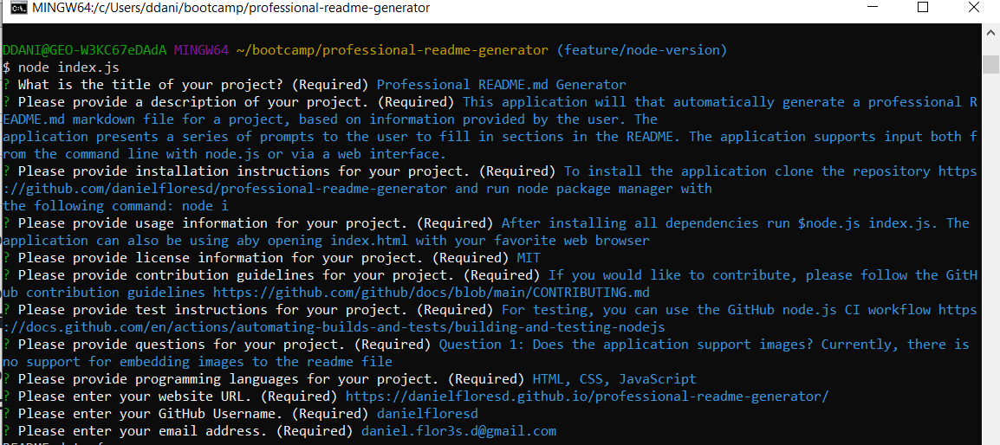

# Professional README.md Generator

## Description   
    This application will that automatically generate a professional README.md markdown file for a project, based on information provided by the user. The application presents a series of prompts to the user to fill in sections in the README. The application supports input both from the command line with node.js or via a web interface.   
<video width="480" height="320" controls autoplay>
  <source src="./assets/images/screencast.webm" type="video/webm">
</video> 

## Table of contents

  * [Description](#description)
  * [Installation](#🛠️installation)
  * [Usage](#💻usage)
  * [Dependencies](#🧩dependencies)
  * [License](#📛license)
  * [Contributing](#🤝contributing)
  * [Tests](#📃tests)
  * [Questions](#❓questions)
  * [Website](#🌐website)
  * [Programming Languages](#👨‍💻programming-languages)

## 🛠️Installation    
    To install the application clone the repository https://github.com/danielfloresd/professional-readme-generator and run node package manager with the following command: node i    
      
## 💻Usage    
    After installing all dependencies run $node.js index.js. The application can also be using aby opening index.html with your favorite web browser
  

## 🧩Dependencies   
* [Inquirer.js](https://www.npmjs.com/package/inquirer)
* [Showdown.js](https://www.npmjs.com/package/showdown)

## 📛License    
    Project license: MIT   

<b>View License</b>
MIT License

Copyright (c) 2022 Daniel Flores D

Permission is hereby granted, free of charge, to any person obtaining a copy
of this software and associated documentation files (the "Software"), to deal
in the Software without restriction, including without limitation the rights
to use, copy, modify, merge, publish, distribute, sublicense, and/or sell
copies of the Software, and to permit persons to whom the Software is
furnished to do so, subject to the following conditions:

The above copyright notice and this permission notice shall be included in all
copies or substantial portions of the Software.

THE SOFTWARE IS PROVIDED "AS IS", WITHOUT WARRANTY OF ANY KIND, EXPRESS OR
IMPLIED, INCLUDING BUT NOT LIMITED TO THE WARRANTIES OF MERCHANTABILITY,
FITNESS FOR A PARTICULAR PURPOSE AND NONINFRINGEMENT. IN NO EVENT SHALL THE
AUTHORS OR COPYRIGHT HOLDERS BE LIABLE FOR ANY CLAIM, DAMAGES OR OTHER
LIABILITY, WHETHER IN AN ACTION OF CONTRACT, TORT OR OTHERWISE, ARISING FROM,
OUT OF OR IN CONNECTION WITH THE SOFTWARE OR THE USE OR OTHER DEALINGS IN THE
SOFTWARE.

    
      
For more information [click here](https://choosealicense.com/licenses/mit).   

## 🤝Contributing    
    If you would like to contribute, please follow the GitHub contribution guidelines. 

https://github.com/github/docs/blob/main/CONTRIBUTING.md   
      
## 📃Tests    
    For testing, you can use the GitHub node.js CI workflow. 
https://docs.github.com/en/actions/automating-builds-and-tests/building-and-testing-nodejs   
      
## ❓Questions   
    Question 1: Does the application support images? Currently, there is no support for embedding images to the readme file    
  You can contact me with the information below:   
*    
*     
        
## 🌐Website    
[https://danielfloresd.github.io/professional-readme-generator/](https://danielfloresd.github.io/professional-readme-generator/)  

## 👨‍💻Programming Languages    
    This project was created with: HTML,CSS,JavaScript   
      
